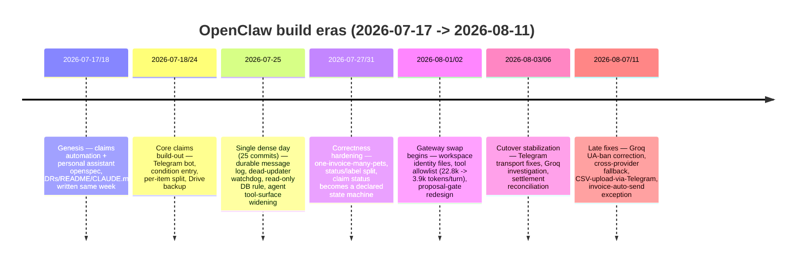
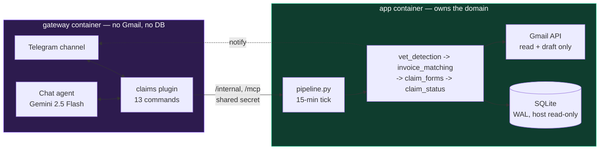
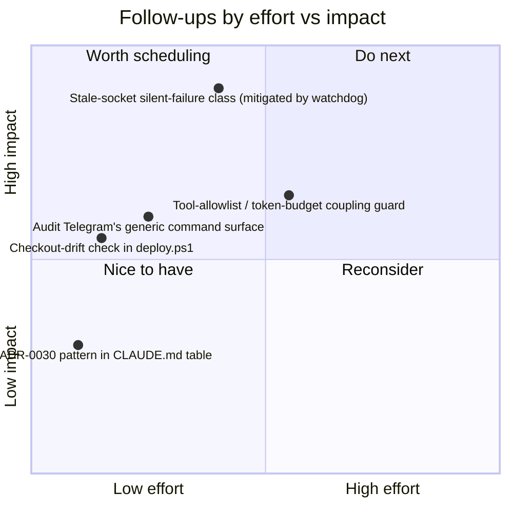

# OpenClaw retrospective — 2026-08-13

A deep look at the setup: architecture, documentation, where scope was deliberately
narrowed ("clipped wings"), and what's worth fixing. Actionable items are tracked in
[#11](https://github.com/jagberg/Me.OpenClaw/issues/11); this doc is the narrative and
the diagrams behind them.

## Project timeline

26 days, 305 commits, five eras. Density triples the moment the gateway swap starts.

## Architecture: the two-runtime boundary

The core structural decision (ADR-0024): the gateway is the shell, Python keeps the
domain. No Gmail credential and no database access cross into the gateway — enforced by
container boundary, not config.

This buys a real guarantee (`send()` doesn't exist anywhere in the gateway's reach, so it
structurally cannot happen) at a real, continuous cost: two `.env` files that have
drifted at least three times, a plugin-hook bug that silently never fired
(ADR-0029), and the stale-socket incident below — all failure modes that only exist
*because* the boundary is a process boundary, not a module boundary.

## Where scope was deliberately narrowed

| Constraint | ADR | Why | Verdict |
|---|---|---|---|
| Chat agent can't read/search Gmail | 0016 | Agent had **fabricated** having checked mail it couldn't see | ✅ right call — narrowed later to 3 named idempotent sweeps, not re-litigated |
| No filesystem/shell/browser tools, no dynamic registration | 0023 | Stock runtime ships 32 tools/32k chars; cut to 1 tool/304 chars | ✅ right call, ⚠️ security + token-budget coupled with **no error if someone adds a tool** (ADR says so itself) |
| Model output can never be the commit | 0025 / 0027 | Model proposed assigning a claim to two pets **despite an explicit prompt rule** | ✅ strongest decision in the project — "the prompt rule lost on live data" |
| No dynamic pet-list memorization | USER.md | Model invented pet names when left to guess | ✅ right call, minor |
| One named exception to never-send (vet invoice-request) | 0030 | Justin's explicit override, scoped to one call site | ✅ well-guarded — rejected a `send: bool` flag specifically to prevent scope creep |
| Domain logic never enters the gateway | 0024 | gmail-isolation-boundary enforced by container, not config | ✅ right call, 🔍 ongoing tax (see architecture above) |
| Telegram's full generic command menu (`/exec`, `/elevated`, `/approve`, 50+ commands) ships alongside the 13 domain commands | — none | Never audited | 🔍 not yet checked whether ADR-0023's own principle was applied one layer too low |

## Findings filed as follow-ups

Full detail in [issue #11](https://github.com/jagberg/Me.OpenClaw/issues/11).

## What's genuinely working

- **Single-writer-plus-guard** is the load-bearing pattern of the whole codebase
  (`claim_status.apply_event`, and five more instances catalogued in
  `app/openclaw/CLAUDE.md`). Claim status used to be 9 write sites across 4 modules,
  6 silently dropping the event — now one function, one test that fails on a violation.
- **ADRs correct themselves in place** rather than getting quietly rewritten — 0028
  reverses 0009's "Groq is unreachable" claim, the claimable-subtotal ADR corrects its
  own "35% is fiction" line after Justin confirmed it's a real policy term. Rare for
  design docs to admit they were wrong.
- **BACKLOG.md** is a working ledger, not a wishlist — dated resolutions, explicit
  reason for existing ("without this file these items would disappear").
- **The gateway-workspace persona files** are honest about their own limits — `SOUL.md`
  opens with "nothing here is a safety control ... they lost once as prompt rules."
  Most projects load up a system prompt with rules and never admit which ones are
  decorative.

## Process note

This session found the local checkout **8 commits behind `origin/master`**, missing
ADR-0031, ADR-0032, and two openspec changes — silent drift, caught only because this
retrospective happened to run `git log --all`. Tracked as item 4 in #11.
